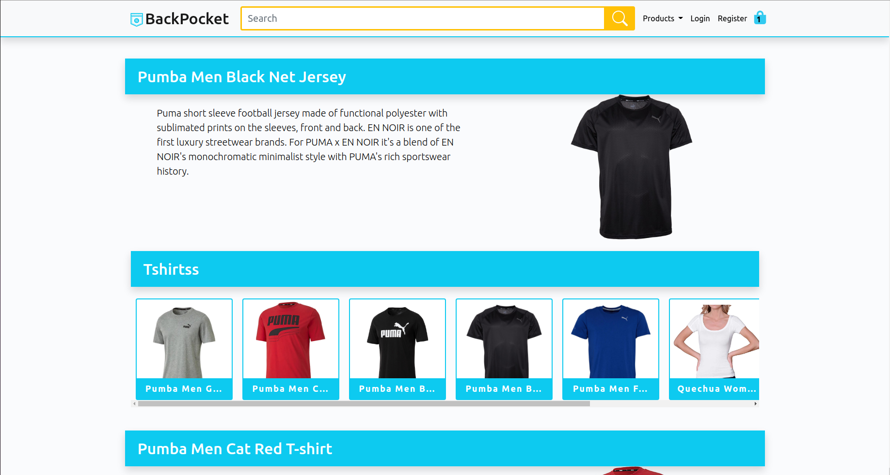
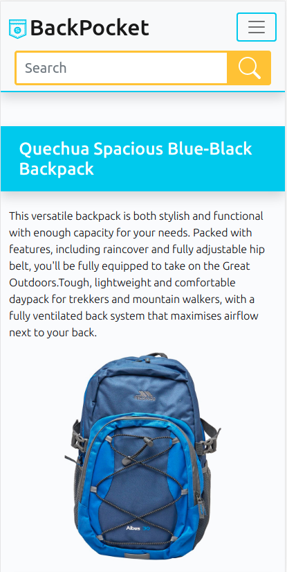
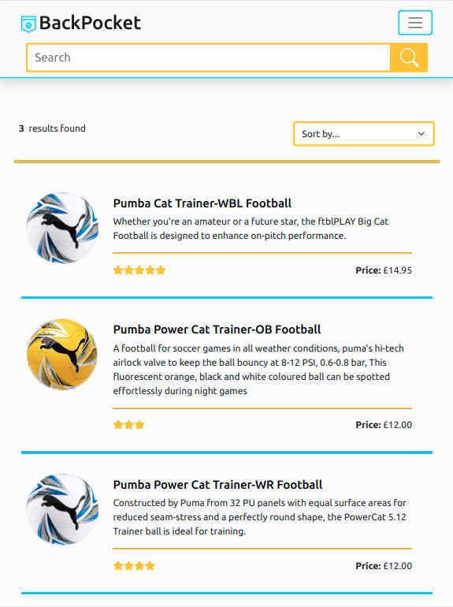

# Milestone Project 4 - E-Commmerce
## <svg width="14" style="fill:#ffffff" aria-hidden="true" focusable="false" data-prefix="fab" data-icon="shirtsinbulk" class="svg-inline--fa fa-shirtsinbulk fa-w-14" role="img" xmlns="http://www.w3.org/2000/svg" viewBox="0 0 448 512"><path fill="#32CAF0" d="M100 410.3l30.6 13.4 4.4-9.9-30.6-13.4zm39.4 17.5l30.6 13.4 4.4-9.9-30.6-13.4zm172.1-14l4.4 9.9 30.6-13.4-4.4-9.9zM179.1 445l30.3 13.7 4.4-9.9-30.3-13.4zM60.4 392.8L91 406.2l4.4-9.6-30.6-13.7zm211.4 38.5l4.4 9.9 30.6-13.4-4.4-9.9zm-39.3 17.5l4.4 9.9 30.6-13.7-4.4-9.6zm118.4-52.2l4.4 9.6 30.6-13.4-4.4-9.9zM170 46.6h-33.5v10.5H170zm-47.2 0H89.2v10.5h33.5zm-47.3 0H42.3v10.5h33.3zm141.5 0h-33.2v10.5H217zm94.5 0H278v10.5h33.5zm47.3 0h-33.5v10.5h33.5zm-94.6 0H231v10.5h33.2zm141.5 0h-33.3v10.5h33.3zM52.8 351.1H42v33.5h10.8zm70-215.9H89.2v10.5h33.5zm-70 10.6h22.8v-10.5H42v33.5h10.8zm168.9 228.6c50.5 0 91.3-40.8 91.3-91.3 0-50.2-40.8-91.3-91.3-91.3-50.2 0-91.3 41.1-91.3 91.3 0 50.5 41.1 91.3 91.3 91.3zm-48.2-111.1c0-25.4 29.5-31.8 49.6-31.8 16.9 0 29.2 5.8 44.3 12l-8.8 16.9h-.9c-6.4-9.9-24.8-13.1-35.6-13.1-9 0-29.8 1.8-29.8 14.9 0 21.6 78.5-10.2 78.5 37.9 0 25.4-31.5 31.2-51 31.2-18.1 0-32.4-2.9-47.2-12.2l9-18.4h.9c6.1 12.2 23.6 14.9 35.9 14.9 8.7 0 32.7-1.2 32.7-14.3 0-26.1-77.6 6.3-77.6-38zM52.8 178.4H42V212h10.8zm342.4 206.2H406v-33.5h-10.8zM52.8 307.9H42v33.5h10.8zM0 3.7v406l221.7 98.6L448 409.7V3.7zm418.8 387.1L222 476.5 29.2 390.8V120.7h389.7v270.1zm0-299.3H29.2V32.9h389.7v58.6zm-366 130.1H42v33.5h10.8zm0 43.2H42v33.5h10.8zM170 135.2h-33.5v10.5H170zm225.2 163.1H406v-33.5h-10.8zm0-43.2H406v-33.5h-10.8zM217 135.2h-33.2v10.5H217zM395.2 212H406v-33.5h-10.8zm0 129.5H406V308h-10.8zm-131-206.3H231v10.5h33.2zm47.3 0H278v10.5h33.5zm83.7 33.6H406v-33.5h-33.5v10.5h22.8zm-36.4-33.6h-33.5v10.5h33.5z"></path></svg> BackPoket- MS4-ecommerce
---

[](https://travis-ci.org/Skrkrw/ms4-ecommerce)


## Project Purpose
<svg width="10" style="fill:#ffffff" aria-hidden="true" focusable="false" data-prefix="fab" data-icon="shirtsinbulk" class="svg-inline--fa fa-shirtsinbulk fa-w-14" role="img" xmlns="http://www.w3.org/2000/svg" viewBox="0 0 448 512"><path fill="#32CAF0" d="M100 410.3l30.6 13.4 4.4-9.9-30.6-13.4zm39.4 17.5l30.6 13.4 4.4-9.9-30.6-13.4zm172.1-14l4.4 9.9 30.6-13.4-4.4-9.9zM179.1 445l30.3 13.7 4.4-9.9-30.3-13.4zM60.4 392.8L91 406.2l4.4-9.6-30.6-13.7zm211.4 38.5l4.4 9.9 30.6-13.4-4.4-9.9zm-39.3 17.5l4.4 9.9 30.6-13.7-4.4-9.6zm118.4-52.2l4.4 9.6 30.6-13.4-4.4-9.9zM170 46.6h-33.5v10.5H170zm-47.2 0H89.2v10.5h33.5zm-47.3 0H42.3v10.5h33.3zm141.5 0h-33.2v10.5H217zm94.5 0H278v10.5h33.5zm47.3 0h-33.5v10.5h33.5zm-94.6 0H231v10.5h33.2zm141.5 0h-33.3v10.5h33.3zM52.8 351.1H42v33.5h10.8zm70-215.9H89.2v10.5h33.5zm-70 10.6h22.8v-10.5H42v33.5h10.8zm168.9 228.6c50.5 0 91.3-40.8 91.3-91.3 0-50.2-40.8-91.3-91.3-91.3-50.2 0-91.3 41.1-91.3 91.3 0 50.5 41.1 91.3 91.3 91.3zm-48.2-111.1c0-25.4 29.5-31.8 49.6-31.8 16.9 0 29.2 5.8 44.3 12l-8.8 16.9h-.9c-6.4-9.9-24.8-13.1-35.6-13.1-9 0-29.8 1.8-29.8 14.9 0 21.6 78.5-10.2 78.5 37.9 0 25.4-31.5 31.2-51 31.2-18.1 0-32.4-2.9-47.2-12.2l9-18.4h.9c6.1 12.2 23.6 14.9 35.9 14.9 8.7 0 32.7-1.2 32.7-14.3 0-26.1-77.6 6.3-77.6-38zM52.8 178.4H42V212h10.8zm342.4 206.2H406v-33.5h-10.8zM52.8 307.9H42v33.5h10.8zM0 3.7v406l221.7 98.6L448 409.7V3.7zm418.8 387.1L222 476.5 29.2 390.8V120.7h389.7v270.1zm0-299.3H29.2V32.9h389.7v58.6zm-366 130.1H42v33.5h10.8zm0 43.2H42v33.5h10.8zM170 135.2h-33.5v10.5H170zm225.2 163.1H406v-33.5h-10.8zm0-43.2H406v-33.5h-10.8zM217 135.2h-33.2v10.5H217zM395.2 212H406v-33.5h-10.8zm0 129.5H406V308h-10.8zm-131-206.3H231v10.5h33.2zm47.3 0H278v10.5h33.5zm83.7 33.6H406v-33.5h-33.5v10.5h22.8zm-36.4-33.6h-33.5v10.5h33.5z"></path></svg> **BackPoket** is a clothing eCommerce wesite, where youth can find from sport clothing and accessories to fashion clothing. The main purpose of this project is set basis and knowledge fo a full stack development project not just those ones that required payment, also those ones that requiere more control on what the user would see depending on their actions when using this website.

Leraning how to handle payments and how some frameworks makes it easy with writting some few lines of code.

The information is comming mainly from [Kaggel](https://www.kaggle.com/paramaggarwal/fashion-product-images-small?select=styles.csv) and the images from google images due to Kaggel only have low quality images. This is a dataset with 60,000 items/products to chose from, which from them randomly where chosen 40.
## User Stories


|  # | As a  | Want to be able to..|
|:--:|-------|---------------------|
|  1 | User  | See a wide range of products when I am in the main/landing page.|
|  2 | User  | See products separated by different sections.|
|  3 | User  | Find easy and not confusing to navegate throw the website.|
|  4 | User  | See particular product in in more detail.|
|  5 | User  | Add more than one poduct to a basket.|
|  6 | User  | Select the size of the product I want to add to the basket.|
|  7 | User  | See the products added in the basket.|
|  8 | User  | Delete items from the basket.|
|  9 | User  | Change the quantity of a item specific.|
| 10 | User  | Go to the checkout and see a sumary of the products before purchase them.|
| 11 | User  | Finish the purchase without the need to create a user account.|
| 11 | User  | Be able to see the detail of the purchase  after submitting the payment.|
| 12 | User  | Create a user to see my previous purchase.|
| 13 | USer  | Edit my default information. |
| 14 | Admin | Add a new product.|
| 15 | Admin | Edit an existing product.|
| 16 | Admin | Delete a product. |


## Technologies Implemented
### Front-End
- HTML
- CSS3
- JavaScript
### Back-End
- Python3
- Django

### Storage
- SQLite3 - Development - Locally
- PostgreSQL- Heroku
- Amazon S3

### Libraries and Framworks
* Bootstrap 5
* Django Template
* jQuery
* Fontawesome
* Stripe
* Widget Tweaks
* Crispy forms
* Django Countries
* Travis

## Tools
This project was developed under a **Linux, debian based OS** and **VScode**, due to the poor internet connection of the location when working on on the project.
## Testing

For the testing in several devices and their respective web browser were used:
| Device            | Web browser           |
|-------------------|-----------------------|
| Galaxy Note 8     | Chrome |
| Galaxy Note 10    | Chrome |
| Galaxy S 20       | Chrome |
| iPhone 6          | Safari|
| iPhone X          | Safari |
| Laptop - Ubuntu   | Crome, Chromiun, Firefox |


## Responsive Design




 

## Deployment
Backpocket was developed on VScode on Ubuntu and for the version control git locally and github to store the project online.

These are the enviroment variables that will go on a env.py file in order to test the app locally with a local server, but in order to be able to test it in Heroku, is important to add the same keys and values in the **keroku's setting variables section**:

| Key                   | Value             |
|-----------------------|-------------------|
| SECRET_KEY            | Your value        |
| EMAIL_HOST_PASSWORD   | Your value        |
| EMAIL_HOST_USER       | Your value        |
| STRIPE_PUBLIC_KEY     | Your value        |
| STRIPE_SECRET_KEY     | Your value        |
| STRIPE_WH_SECRET      | Your value        |
| USE_AWS               | Your value        |
| AWS_ACCESS_KEY_ID     | Your value        |
| AWS_SECRET_ACCESS_KEY | Your value        |
| DATABASE_URL          | Your value        |
### Local Deployment
The project can be clone from the github repository link [https://github.com/Skrkrw/ms4-ecommerce](https://github.com/Skrkrw/ms4-ecommerce), while using gitpod is an easy task, using VScode or any other tool can be bot so complicate, having as a first option the direct download by clicking on the download button. The second option is coloning directly with the git command:
```
    $ git clone https://github.com/Skrkrw/ms4-ecommerce
```
in order to done affect other projects and also avoid adding components, libraries and unnecessary tools that will only made the project bigger and slow is a good practice to work under a virual enviroment, to create one is just necessary locante in the termail where is desire to creat the virtual envirment and type the next command:

```
    $ python3 -m venv /address, path or name for the new virtual env/
```

With the next command the virtual enviroment is activated and ready to be use:
```
    $ source <venv address>/bin/activate
```

From now on, every python package or dependency we installed, they will be only installed in the virual enviroment and take effect only  while the virtual enviroment is activated and this will not affect the OS. It is important to use the next command to keep track of all the packages installed and to make it easy to install them again on a different machine.

Export packages to requirements.txt file:
```
        $ pip3 freeze -r requirements.txt
```

Install packages:
```
        $ pip3 install -r requirements.txt
```

Place the terminal in the root of the project and run the next command to turn the computer into a local server and then the application will be alive, just locally:
```
    $ python3 manage.py runserver
```

To gain admin access to and be able to add, edit and delete prducts from the django admin page, type the next command:

```
    $ python3 manage.py createsuperuser
```

Also is possible to add, delete and modify products from the fixtures files:
- articles.json
- category.json
- gender.json
- products.json
- products.json
- sub_category.json

Once the products are added on the json files, just use the next command with the file name without theextension:
```
    $ python3 manage.py loaddata <filename>
```


Once there create a .gitignore file, create the env.py file and add it into the .gitignore file to avoid exposing sensitive information such as passwords, secret keys like the ones needed for this project:

- SECRET_KEY
- EMAIL_HOST_PASSWORD
- EMAIL_HOST_USER
- STRIPE_PUBLIC_KEY
- STRIPE_SECRET_KEY
- STRIPE_WH_SECRET


### Deployment in Heroku
To be able to deploy in heroku is important to create an account making sure of selecting the closest server to the region you live in.

### Amazon WEb Services S3
BotoS3 is a python package from Amazon to make it easy to store the static files and the images in amazon rather than heroku.
## Features
### Features implemented
#### Navbar
- The navegation bar is responsive with a searche bar which makes it easy to be used on all screens size.
#### Landing page
- The products shown in the lading page changes every time the page is refreshed.
### Features left for future implementation
#### Pagination
- Left for future implementation as there are some issues to solved when changing page and not getting the right products.
#### Responsive images
- Rezise images for different use case and ensure the loading is of the app is not heavy on any screen size.

#### Edit Size
- The posibilitiy to edit the size straight in the shopping bag just like is possible to do with the quantity.

## Documentation and Help
[Django 3.1 Documentation](https://docs.djangoproject.com/en/3.1/)

[Kaggel](https://www.kaggle.com/paramaggarwal/fashion-product-images-small?select=styles.csv)

Code Insitute Tutors: I would like to thanks to all the tutors who where there to help with there expertise and hability to spot my own mistakes, also to thanks to be there, sometimes this is eveything we all students need keep on trying and going, this is my case and thanks a lot for that, because sometimes I was able to learn from them and somtimes from my own mistakes and even to solved sometimes the problems.
Code Instute Mentor: Thanks to Guido Cecilio, my mentor, for all this time of learning and pushing me to to always deliver more from me.
## Credits

This project could be possible without Code Institute's mini project Boutique Ado, whiche helped to understand. No all of the mini-project was used and it was customed according to Backpocket's needs.

For this reason I would like to thanks Code Institute team, the tutors and my mentor who were there during all this time to helped me to understand and solved some issues I was oin through.
